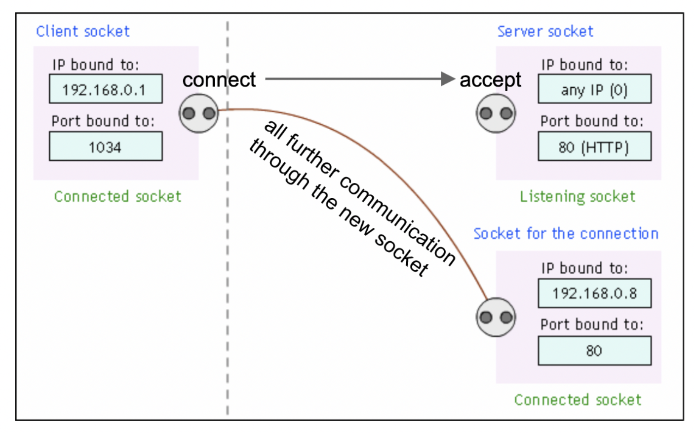

# Sockets, Server Testing, and Endianness 

## Sockets and HTTP

### What is a socket?
A socket is a software construct used for many modes of communication between
processes. The mode of communication that this recitation will focus on is
network communication. In particular, stream sockets represent an endpoint for
reliable, bidirectional connections such as TCP connections. This allows for two
processes, on separate computers, to communicate over a TCP/IP network
connection.

Sockets have:
- an IP address, to (typically) identify the computer that the socket endpoint
  belongs to
- a port number, to identify which process running on the computer the socket
  endpoint belongs to
- a protocol, such as TCP (reliable) or UDP (unreliable). Stream sockets use TCP

An IP address and port number are both required in order for a computer to
communicate with a specific process on a remote computer. 

### The client-server model
The two endpoints in a socket connection serve different roles. One end acts as
a *server*: 
- It tells the operating system that it should receive incoming connections on a
  port number
- It waits for incoming connections
- When it receives a connection, it creates a *new socket* for each client,
  which will then be used to communicate with that client

The other end is a *client*:
- It "connects" to the server using the server’s IP address and the port number

After a client connects to a server, there is bidirectional communication
between the two processes, often with I/O system calls such as `read()` and
`write()`, or their socket-specific variants `recv()` and `send()`. 

### Sockets with netcat
A simple way to demonstrate the bidirectional and network-based communcation of
sockets is with `netcat`. `netcat` is a bare-bones program to send streams of
binary data over the network.

Imagine we have two computers that can communicate over the internet, with the
IP addresses `clac.cs.columbia.edu` and `clorp.cs.nyu.edu`.

Because of the client-server model, connecting two socket endpoints to each
other is not a symmetrical process. One socket needs to act as the server, while
the other needs to act as a client. You tell `netcat` to act as a server with
the `-l` flag:

```console
leslie@ap.cs.columbia.edu:~$ nc -l 10000
```

The `netcat` program on `clac.cs.columbia.edu` will create a socket and wait for
connections on port 10000. To tell `netcat` to act as a client, you supply the
IP address of the server and the port number of the socket listening on that
server:

```console
joseph@ap.cs.nyu.edu:~$ nc clac.cs.columbia.edu 10000
```

Notice the differences between these two commands. The first command only
requires a port number, and doesn't require the IP address of the other
computer. The second command requires knowledge of both the IP address (what
computer to connect to) and the port number (which process to connect to on that
computer). This asymmetry is the client-server model.

After the client connects to the server, the server `netcat` process creates a
new socket for bidirectional communicaiton. After the two processes connect
there is no functional difference between client and server. What you type on
one end should be visible on the other -- a full duplex stream of data. 

### Sockets API Summary
 

**`socket()`**
- Called by both the client and the server
- On the server-side, a listening socket is created; a connected socket will be
  created later by `accept()`

**`bind()`**
- Usually called only by the server
- Binds the listening socket to a specific port that should be known to the
  client

**`listen()`**
- Called only by the server
- Sets up the listening socket to accept connections

**`accept()`**
- Called only by the server
- By default blocks until a connection request arrives
- Creates and returns a new socket for each client

**`connect()`**
- Called only by the client
- Requires an IP address and port number to connect to
- Attempt to establish connection by reaching out to server

**`send()` and `recv()`**
- Called by both the client and server
- Reads and writes to the other side
- Message boundaries may not be preserved
- nearly the same as `write()` and `read()`, but with socket-specific options

A TCP client may use these functions as such:
```c
int fd = socket(...);
connect(fd, ... /* server address */);

// Communicate with the server by send()ing from and recv()ing to fd.

close(fd);
```

And a TCP server:

```c
int serv_fd = socket(...);
bind(serv_fd, ... /* server address */);
listen(serv_fd, ... /* max pending connections */);

// use an infinite loop, to continue accepting new incoming clients
for (;;) {
    int clnt_fd = accept(serv_fd, ...);

    // Communicate with the client by send()ing from and recv()ing to
    // clnt_fd, NOT serv_fd.

    close(clnt_fd);
}
```

### Listening socket vs connected socket


To form a bidirectional channel between client and server, three sockets are used:
- The server uses two sockets
  - The listening socket, to accept incoming connections from a client
  - The client socket, which is created when an incoming connection has been
    `accept()`ed. 
- The client uses one socket
  - The `connect()`ing socket, which reaches out to the server. Once the
  connection has been made, communication can be done between the server's client
  socket and the client's connecting socket.

## Endianness
#Big-Endian and Little-Endian
When we deal with reading and writing data, we must know what format those bytes are appearing in. 
The order that a multi-byte number appears in is called "endianness". 
```
There is big-endian and little-endian. 
In big-endian, bytes are arranged from the most significant byte (MSB) to the least significant byte (LSB). For example, the number 8 would be represented in big-endian as follows: 
+------+------+------+------+
| 0x00 | 0x00 | 0x00 | 0x8  |         (big-endian representation of 0x00000008)
+------+------+------+------+

In little-endian, bytes are arranged from least significant byte (LSB) to most significant byte (MSB). The same number above would be represented in little-endian as follows:
+------+------+------+------+
| 0x8 | 0x00 | 0x00 | 0x00  |         (little-endian representation of 0x00000008)
+------+------+------+------+
```
The endianness of your host machine depends on what computer architecture your program is running on. Most computers we use nowadays are little-endian. Network endianness is always big-endian.

There is big-endian and little-endian. 
In big-endian, bytes are arranged from the most significant byte (MSB) to the least significant byte (LSB). For example, the number 8 would be represented in big-endian as follows: 
```
+------+------+------+------+
| 0x00 | 0x00 | 0x00 | 0x8  |         (big-endian representation of 0x00000008)
+------+------+------+------+

In little-endian, bytes are arranged from least significant byte (LSB) to most significant byte (MSB). The same number above would be represented in little-endian as follows:
+------+------+------+------+
| 0x8 | 0x00 | 0x00 | 0x00  |         (little-endian representation of 0x00000008)
+------+------+------+------+
```

The endianness of your host machine depends on what computer architecture your program is running on. Most computers we use nowadays are little-endian. Network endianness is always big-endian.

#Endian Converting Functions

There are four main functions we should know regarding endianness: ntohl(), htonl(), ntohs(), and htons(). 

ntohl() and htonl() stand for "network to host long" and "host to network long", respectfully. These functions operate pretty much as they sound: they convert an 8 byte number from network endianness (big-endian) to host endianness (little-endian) or vice versa. This is performed by swapping *bytes* in a number. *Note, bits are not swapped, but entire bytes are. These functions are blind to what you (the programmer) are trying to do--when it's called, it simply just swaped the bytes. Therefore functionally, ntohl() and htonl() are identical functions under the hood. 

ntohs() and htons() stand for "network to host short" and "host to network short", respectfully. These functions operate the same as those above, except for taking in a 4 byte number (the size of a short).

An important thing to note is depending on the endianness of your local machine, all of these endian converting functions could perform one of two actions: swap the internal bytes or do nothing. If your local machine is little-endian, all of these functions will swap bytes each time they are called. (ie they have no regard for whether the bytes you pass in actually need to be swapped to achieve the goal endianness). If your local machine is big-endian, these functions will do nothing.

# Endianness Puzzle
Below is a short puzzle where you can practice your understanding of endianness:

# Leslie make this chunk below code

```c
  //On AP Server: little-endian
  struct addrinfo hints = {0}, *info;
  
  //assign constants
  hints-ai_family = AF_INET;
  hints ai_socktype = SOCK_STREAM;
  hints.ai protocol = IPPROTO TCP:
  
  //TCP/IP
  //allocate address info, make info a pointer to it
  getaddrinfo("12.34.56.78","g", &hints, &info);
  
  struct sockaddr in *addr = (struct sockaddr in*) info->ai addr:
  
  uint32_t na = addr->sin_addr.s_addr; //get the IPv4 address (big endian)
  uint32_t ha = ntohl(addr->sin_ addr.s addr); //network to host, convert to little endian
  
  uint16 t a = addr->sin port; //port number (big endian)
  uint16 t b = htons (addr->sin port); //convert host to network, to big endian
  uint16 t c = *(uint16 t*) &na;
```

What is in each byte of the following values:
```
  na:
+------+------+------+------+
|      |      |      |      |        
+------+------+------+------+
  ha:
+------+------+------+------+
|      |      |      |      |        
+------+------+------+------+
  a:
+------+------+
|      |      |          
+------+------+
  b:
+------+------+
|      |      |          
+------+------+
  c:
+------+------+
|      |      |          
+------+------+
```

Puzzle Solutions (Leslie are you able to make this a dropdown lol. its ok if not)
```
  na:
+------+------+------+------+
| 12   | 34   | 56   | 78   |        
+------+------+------+------+
  ha:
+------+------+------+------+
|   78 |   56 |   34 |   12 |        
+------+------+------+------+
  a:
+------+------+
|  0   |   9  |          
+------+------+
  b:
+------+------+
|  9   |   0  |          
+------+------+
  c:
+------+------+
|  12  |   34 |          
+------+------+
```

When we deal with reading and writing data, we must know what format those bytes are appearing in. 
The order that a multi-byte number appears in is called "endianness". 

There is big-endian and little-endian. 
In big-endian, bytes are arranged from the most significant byte (MSB) to the least significant byte (LSB). For example, the number 8 would be represented in big-endian as follows: 
```
+------+------+------+------+
| 0x00 | 0x00 | 0x00 | 0x8  |         (big-endian representation of 0x00000008)
+------+------+------+------+

In little-endian, bytes are arranged from least significant byte (LSB) to most significant byte (MSB). The same number above would be represented in little-endian as follows:
+------+------+------+------+
| 0x8 | 0x00 | 0x00 | 0x00  |         (little-endian representation of 0x00000008)
+------+------+------+------+

The endianness of your host machine depends on what computer architecture your program is running on. Most computers we use nowadays are little-endian. 
```

## Acknowledgements
- Some examples were taken from John Hui's [Advanced
  Programming](https://cs3157.github.io/www/2022-9/) lecture notes. We recommend
  reading them on top of these recitation notes.
  - [Lecture 13 - TCP/IP Networking](https://cs3157.github.io/www/2022-9/lecture-notes/13-tcp-ip.pdf)
  - [Lecture 14 - HTTP](https://cs3157.github.io/www/2022-9/lecture-notes/14-http.pdf)
