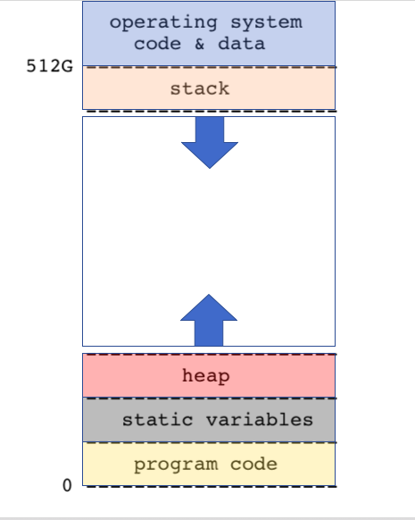

# Memory and Pointers #

Understanding pointers and the ins and outs of memory usage in your program is a fundamental part of what makes you a strong C programmer! This note breaks down important elements that go into this understanding.   


## Memory ##

### Address Space ###

Every process, i.e a running program, gets 512G of virtual memory space on the AP server. The memory layout is given in the diagram below.



The stack grows downwards while the program code, static variables, and heap variables are all at the bottom (0), sitting in that order (Check the diagram above). This means that when functions are called, space for them is built up on the stack and then cleared as they complete. Imagine function calls being stacked on top of each other (but upside down) and then being popped off last to first as they return. The stack is a *temporary* storage space.

The heap is where you dynamically allocate memory (using ``malloc()``) - it is a storage space that is not automatically managed like the stack. You use the heap if you want to manage how long something is stored in memory, which means you are responsible for clearing any space you allocate on the heap (using ``free()``). Also note that unlike the stack, the heap grows upwards (towards the stack). 

### Variables ###

#### Stack Variables ####

When you declare a variable in C, it is defined for the current scope and will be released (removed from memory) at the end of the scope.

```c
int x;
x = 0;
//do things with x
{
    int x;
    x = 1;
    //x is now 1 within here
}
//x is still 0 out here
```

The variables inside the curly braces are **stack variables**, and are stored on the stack. Their scope is local to a block (meaning code enclosed by curly braces, as shown above). They are created (pushed on the stack) when entering the block and destroyed (popped off the stack) upon exit.

#### Static and Global Variables ####

Static and Global variables are stored in the static section of the C memory layout (see diagram above). 'static' has different meanings depending on where you declare your value. In general, **global** and **static** variables are created when the program runs, and they persist until the program ends. *They have the lifetime of the program*. They cannot be re-declared or re-initialized.

```c
static int file_static = 0; // static global variable

int foo(int auto_1) {
    static int block_static = 0; //static variable
}
```

A **static global variable** is declared by using the ‘static’ keyword on a variable declaration outside of any code blocks in the file, i.e outside of any function. Its scope is limited to the current file. It’s accessible anywhere in the file it is declared in, but not in any other file. 

A **static variable** is declared by using the ‘static’ keyword on a variable declaration inside a function. It is initialized once and retains its value over successive calls of that function, as shown here ([source](http://stackoverflow.com/a/23777789)):

```c
int foo()
{
    static int x = 5; // assign value of 5 only once
    x++;
    return x;
}

int main()
{
    printf("%d\n", foo()); // prints 6
    printf("%d\n", foo()); // prints 7
    return 0;
}
```

A **global variable** is like a special case of static variables. It is accessible from all files in the program, and can be accessed from other files using the `extern` keyword. See below:

In one file:

```c
int global_static = 0;

int main() {
    global_static++;
    magic_print();
	return 0;
}
```

In another file:

```c
void magic_print() {
    extern int global_static;
    printf("%d\n", global_static); // prints 1
}
```

## Pointers ##

Understanding pointers is crucial and using them naturally will make you stand out as a programmer. Let's start with the basics.

**Pointer:** A variable that stores a memory address. That's it. The memory address is _just a number_.

There isn't just one data type called "pointer". Every pointer is a
pointer-to-type, which encodes how to interpret the bytes you find in the memory address.

In a variable declaration, an asterisk denotes the fact that the variable is a pointer.

Here's an example:

```c
int x = 5; // x is a plain int
int *p; // p is a pointer-to-int
```

### Using basic pointers ###

There are two basic operators that you use with pointers: 

The `&` operator references a value, ie it gets the memory address of an
already existing variable. It could then be stored into a pointer.

```c
int x = 5; // x is a plain int
int *p; // p is a pointer-to-int
p = &x; // p now points to x, meaning p holds x's memory address
```

The `*` operator *dereferences* a pointer: it follows the pointer to retrieve the value it points to

```c
int x = 5;
int *p = &x; 
printf("%d", *p); //prints out 5
*p = 9;  // now x is 9
```

`&` and `*` are basically opposites: `&` adds a level of indirection, while `*` removes a level, bringing you closer to the underlying value. 


### Ok, so why use pointers? ###

C is a **call-by-value** language which means all arguments to functions are copied, and a local copy is made on that function's stack. Changes made inside the function are not reflected on the outside. 
__Therefore if you want a function to modify a value that you have, you'll have to tell the function where to find the that value by memory address, not just give it the value:__

```c
void increment(int a) {
  a++;
}

void actually_increment(int *b) {
  (*b)++;
}

int main() {
  int x = 1;
  increment(x); // x is still 1
  actually_increment(&x); // x is now 2
  return 0;
}
```

**Note: passing a pointer is very different than passing a value.**
When you pass ``x`` into ``increment(x)``, it will only live within the scope of ``increment()`` and be trashed afterwards.
If you pass a pointer ``&x`` into ``actually_increment(&x)``, it will increment the value of ``int x`` that lives in the main function.


## Pointer Arithmetic ##   

If you have a pointer, you can do basic arithmetic with it to address adjacent elements. All arithmetic is with respect to the type of element being addressed, so if you have an int pointer `int *p`, `p+1` points to the next int, which is 4, or if you have a short pointer `short *p`, `p+1` points to the next short, which is 2 bytes later. *Think in terms of elements, not in terms of bytes.*


## Arrays ## 

Arrays are a contiguous set of bytes in memory. 

The `sizeof()` operator returns the number of bytes occupied by the array. In this case, `a` is an array of 10 `int` elements. The `sizeof(int)` is 4, therefore the `sizeof(a)` = 40.

```c
int a[10];
printf("%d", sizeof(a)); // This will print "40"
```


## Arrays and Pointers ## 

Arrays and pointers behave very similarly, but it is important to know the differences!


Given pointer `p` of type `T*` and integer `i`

`*(p+i) == p[i]`

In other words, this means that the `p[i]` is exactly the same thing as `*(p+i)`. Essentially, we can use the square brackets `[]` with a pointer to find the address of the `i`th element away from `p`. Then we can dereference the new address and voilá, we have the `i`th element itself!

If this is sounding a lot like an array, that's because it basically is! If we set a pointer to the beginning of an array, we can use the exact same syntax to access the elements in the array that we want.


```c
int a[10] = {0, 1, 2, 3, 4, 5, 6, 7, 8, 9};
int *p = a; // p points to the first element of `a`, 0
int *p = &a[0]; //p still points to 0

*(p+5) == a[5]; // 5 == 5

p+5 == a+5; // p+5 is a pointer to the 5th element of the array, so is a+5
```

This rule goes the other way too! Arrays, in cases of pointer arithmetic, operate as pointers to the first element.
> i.e. Given an array `a` of type `T` elements </br>
> a+1 == &a[0]+1

So aren't pointers and arrays the same? **Wrong**! Here are the cases in which arrays do not act like pointers.

**`sizeof` operator**

Note that as discussed above, `sizeof` is an operator, not a function. Which means that for classic C `sizeof` is evaluated at *compile time*, so the value of the operator cannot be anything that depends on user input.

**Array is a constant variable**

```c
int a[10] = {0, 1, 2, 3, 4, 5, 6, 7, 8, 9};
int *p = a; // p points to the first element of `a`, 0

p++; // ok: `p` is just a pointer like any other, p now points to the next element in the array
a++; // illegal (will throw an error): `a` is an array name, a constant variable
```

Unlike a pointer, though, an array is a constant variable. You cannot change its assignment after it has been created, it must point to the same chunk of memory.


**Arrays cannot be passed into functions**

Note that once you pass an array into a function, the array becomes a pointer to the first element, and loses all its array-ness. So within the scope where `int a[10]` was declared, `sizeof(a)` returns the number of bytes of the array `a`, ie 40. But if you pass `a` into a function as `arr`, then `sizeof(arr)` is NOT 40, but 8, which is the size of a pointer.


### Strings in C ###

Strings in C are just a special case of arrays: C strings are arrays of
characters with a null terminating character at the end.

```c
char c[] = "abc";
char c[] = {'a', 'b', 'c', '\0'}; 
char *s = "my string";
"my string"[0] == 'm'; //true!
```

There's a slight difference between these two definitions. `c` is an array which means you can't move where it points to: it's always going to point to the character `a`. `s`, on the other hand, can be incremented and decremented and moved around however you like. `"my string"`, however, can't be modified; it's a string literal! 


So how about an array of strings? Well that would be an array of arrays.

```c
char *a[] = {"hello", "world" };
char **p = a;
char a[][10] = {"hello", "world" }; //what's the difference here?
```

## Acknowledgements ## 

This recitation was originally developed by Jae Woo Lee.
Claudia Cortell and Shreya Somayajula adapted it in Spring 2023.
